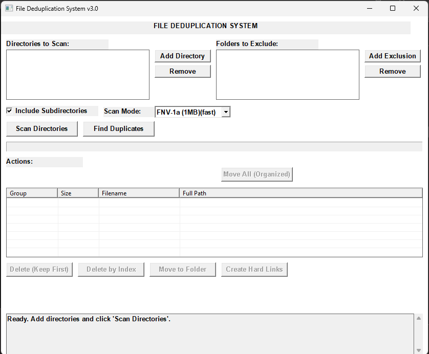
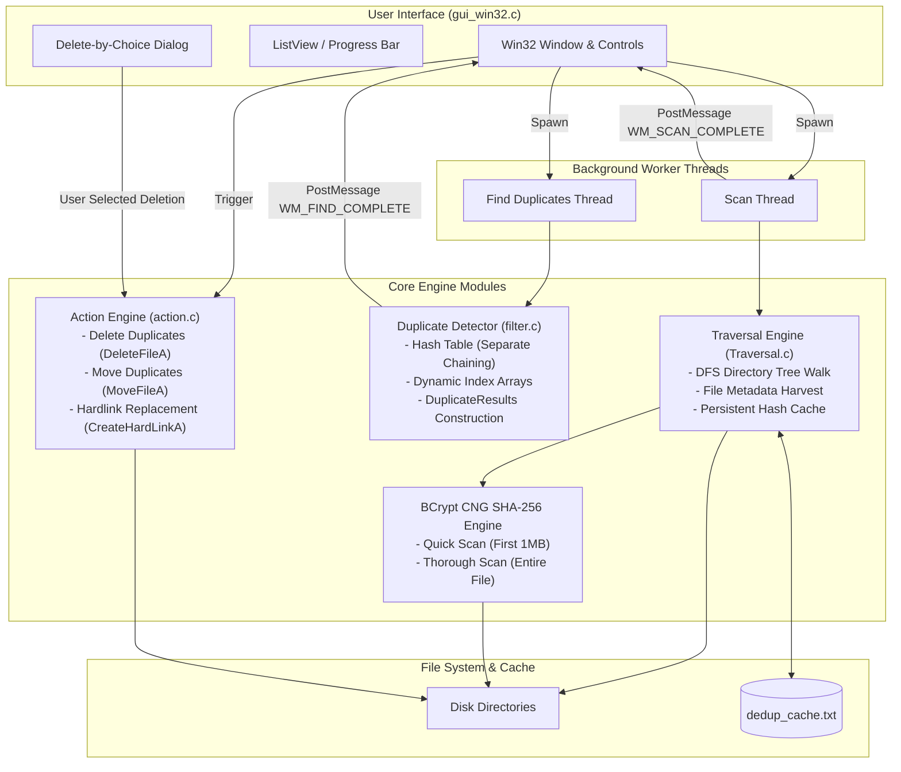
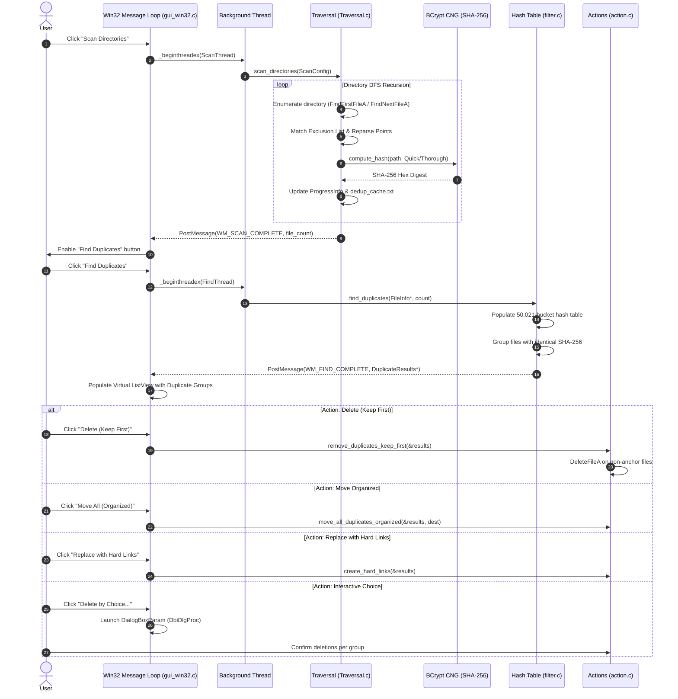
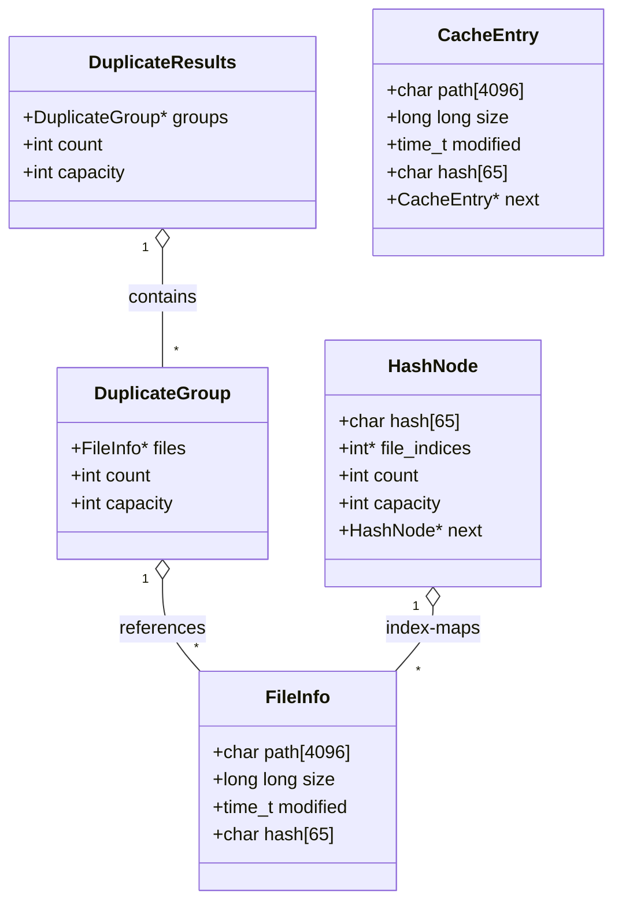

<div align="center">

# WinDedup: Native Win32 File Deduplication Engine

[](https://en.cppreference.com/w/c/11)
[](https://microsoft.com)
[](https://learn.microsoft.com/en-us/windows/win32/)
[-green.svg)](https://learn.microsoft.com/en-us/windows/win32/seccng/cng-features)
[-brightgreen.svg)](#building--running)

<br/>

<p align="center">
  <b>A lean, deterministic desktop storage analyzer and deduplication utility built directly against the Windows subsystems.</b>
</p>

</div>

---

### Operational Model & Engineering Highlights

> **Design Tenets & Core Capabilities**
> - **Decoupled Asynchronous Dispatch:** Heavy disk enumeration and cryptographic verification run on dedicated background threads, maintaining a fluid Win32 message pump while streaming real-time progress indicators to the Windows taskbar via `ITaskbarList3`.
> - **In-Place Hardlink Re-pointing:** Rather than resorting to unrecoverable file deletion, duplicate nodes can be converted into NTFS hard links, instantly reclaiming physical disk sectors while preserving existing directory paths and programmatic file references.
> - **I/O Overhead Mitigation:** Skips repetitive passes on cold runs through size-bucket pruning and cached metadata signatures, reading only what is strictly required to verify byte identity.

---

## Interface

<div align="center">
  
</div>


---

## Architecture & System Map

### 1. Component Architecture & Data Flow



---

### 2. Execution Pipeline


---

### 3. Core Data Structures



---

## File Map

| File | Role | Key APIs / Responsibilities |
|---|---|---|
| `common.h` | Shared definitions | Structs (`FileInfo`, `DuplicateGroup`, `DuplicateResults`, configs), threading primitives, constants. |
| `gui_win32.c` | UI & Orchestration | Win32 message loop, `CreateWindowExA`, ListView virtual rendering, worker thread management, taskbar progress (`ITaskbarList3`), Delete-by-Choice modal dialog. |
| `Traversal.c` | Filesystem traversal | `FindFirstFileA` / `FindNextFileA` recursive DFS, reparse point skipping, Windows CNG BCrypt SHA-256 computation, persistent cache in `dedup_cache.txt`. |
| `filter.c` | Duplicate detection | 50,021-bucket hash table with separate chaining, amortized O(1) dynamic index array resizing, duplicate group assembly. |
| `action.c` | Duplicate resolution | `DeleteFileA` (keep-first removal), `MoveFileA` (flat & organized folder grouping with collision suffix `_1`), `CreateHardLinkA` deduplication. |
| `features.c` | Standalone QOL module | File logging (`log_operation`), size/extension filters (`should_process_file`), CSV/text export (`export_duplicates_csv`), standalone safe actions with dry-run support. |
| `cli_main.c` | Headless CLI layer | Command-line tool with machine-readable JSON (`--json`), `--dry-run`, size/extension filtering, and batch automation. |
| `build.bat` | Build pipeline | MinGW/GCC build automation compiling GUI (`FileDeduplication.exe`) and CLI (`dedup-cli.exe`). |

---

## Building & Running

### Requirements
- Windows 7 SP1 or newer (`_WIN32_WINNT=0x0601`)
- GCC (MinGW-w64) in `PATH`

### Build Command
```cmd
build.bat
```

Compiles two binaries into `build\`:
1. `build\FileDeduplication.exe` — Interactive Win32 desktop application
2. `build\dedup-cli.exe` — Headless scriptable CLI binary with JSON support

### Manual Compilation
```cmd
gcc -Wall -Wextra -std=c11 -O2 -D_WIN32_WINNT=0x0601 ^
    action.c filter.c gui_win32.c Traversal.c features.c ^
    -o build\FileDeduplication.exe ^
    -lcomctl32 -lshell32 -lole32 -luser32 -lgdi32 -lkernel32 -lbcrypt -luuid
```

---

## Scan Modes & Actions

- **Quick Scan (`SCAN_QUICK`):** Reads and hashes the first 1 MB (`1024 * 1024` bytes) using SHA-256. Ideal for large media collections with distinct headers.
- **Thorough Scan (`SCAN_THOROUGH`):** Memory-maps or reads the entire file to produce an end-to-end SHA-256 digest.
- **Actions:**
  - `Delete (Keep First)`: Deletes duplicate instances, retaining index 0.
  - `Move All (Organized)`: Moves single duplicate pairs into flat folder; multi-duplicate clusters into subdirectories named after original file.
  - `Replace with Hard Links`: Replaces duplicate files with NTFS hard links (`CreateHardLinkA`), freeing physical disk space while keeping all file paths intact.
  - `Delete by Choice`: Interactive dialog to inspect metadata differences and select which specific duplicates to discard.
